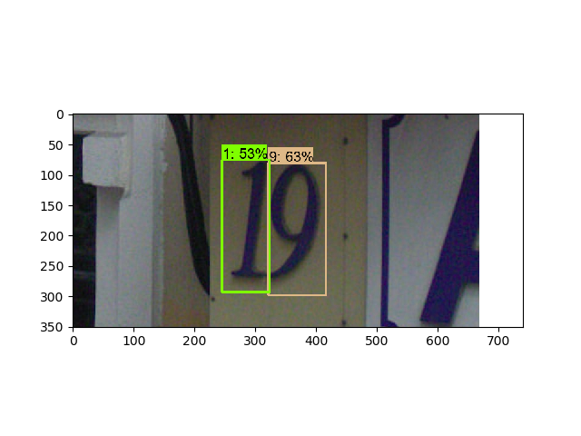
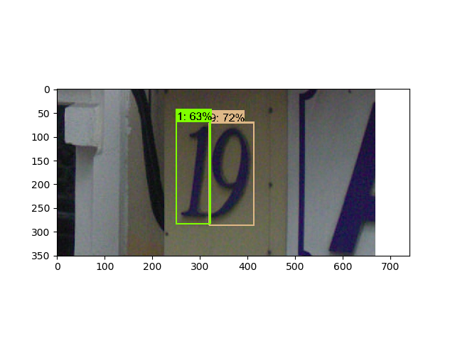

# Retinanet Digit Detector

I have implemented retinanet digit detector using [keras-retinanet package](https://github.com/fizyr/keras-retinanet) and [svhn dataset](https://github.com/penny4860/svhn-voc-annotation-format).



## Usage for python code

#### 0. Requirement

* python 3.6
* tensorflow 1.10.0
* keras 2.2.4
* keras-retinanet 0.5.0

#### 1. Digit Detection using pretrained weight file

In this project, the pretrained weight file is stored in [resnet50_full.h5](https://drive.google.com/drive/folders/1kKmDqZ1G4TC-OD3IRdTSJA5H4n6ZAouN). Test set evaluation (13068-images) score is ```mAP: 0.8148```

* Download [resnet50_full.h5](https://drive.google.com/drive/folders/1kKmDqZ1G4TC-OD3IRdTSJA5H4n6ZAouN) to the ```project-root/snapshots```
* Run ```infer.py```

You can see the following figure:



